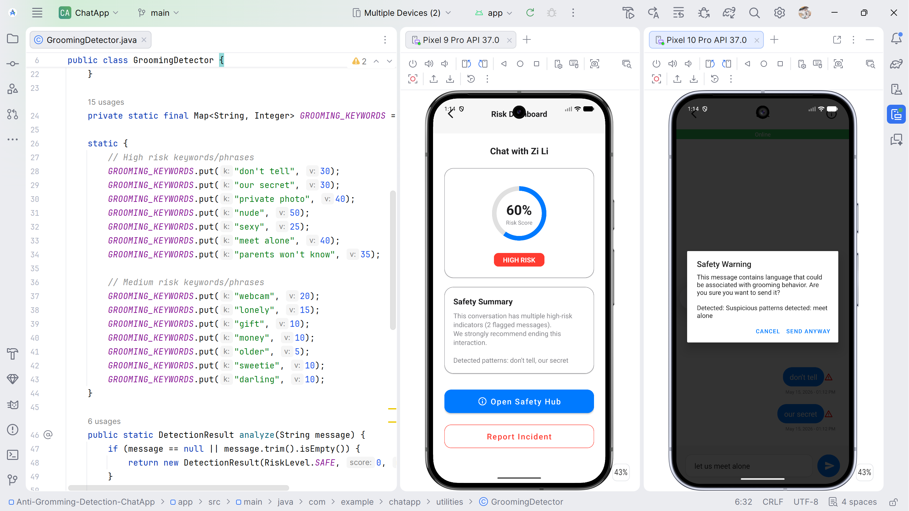

## Anti-Gromming-Detection-ChatApp

A grooming-aware Android chat application built for female online safety. SafeChat embeds real-time AI-assisted grooming risk detection directly within a native messaging environment, protecting users at the point where risk actually occurs: inside the conversation itself.

## Demo

[](https://github.com/zilitye/Anti-Gromming-Detection-ChatApp/releases/download/v1.0.0/app-release.apk)

Install and run `app-release.apk`. Requires Android 7.0 or higher



## Features

1. Real-Time Chat with Grooming Detection

Every outgoing message is silently screened by a weighted keyword scoring engine before it is delivered. Messages are classified into three levels:

| Level | Token Score | Action |
|-------|-------------|--------|
| Safe | Below 20 | Message sent normally |
| Warning | 20 – 49 | Alert shown; user may proceed |
| Blocked | 50+ | Message blocked from sending |

2. Safety Hub (AI Assistant)

A dedicated screen powered by the **Google Gemini API**. Users can ask the AI assistant about grooming warning signs, seek safety guidance, or get help preparing a report, all without leaving the app. 

Three modes are available:
- Q&A (general grooming awareness questions)
- Policy Analysis (understanding relevant laws and policies)
- Report Assistant (guided help drafting a formal report)

3. Risk Dashboard

A per-contact risk dashboard aggregates token scores across an entire conversation history, giving users a longitudinal view of whether a contact's communication pattern reflects escalating grooming behaviour over time.

4. Users can flag a conversation directly from the chat screen. The conversation evidence is forwarded to the Gemini API for AI-assisted analysis, and a summary is presented to the user before formal submission.

5. Authentication

## Tech Stack

| Layer | Technology |
|-------|-----------|
| Language | Java (Android SDK) |
| UI | XML layouts, View Binding, RecyclerView |
| Database | Firebase Firestore |
| Push Notifications | Firebase Cloud Messaging (FCM) |
| AI / LLM | Google Gemini API (`gemini-flash-latest`) |
| HTTP Client | Retrofit 2 |
| Markdown Rendering | Markwon |

## Project Structure

<p>
    
    
</p>

## Setup & Installation

1. Clone the repository
```bash
git clone https://github.com/your-username/Anti-Gromming-Detection-ChatApp.git
cd Anti-Gromming-Detection-ChatApp
```

2. Connect Firebase
- Create a project at Firebase Console
- Enable **Firestore Database** and **Cloud Messaging**
- Download `google-services.json` and place it in `app/`
- Navigate to Project Settings.
- Select the Service Account tab.
- Click on Generate New Private Key to download the `service_account.json` file.
- Place `service_account.json` it inside your app’s `app/src/main/assets` directory in Android Studio.

3. Add your Gemini API key
- Open `app/src/main/java/com/example/chatapp/utilities/Constants.java` and replace:
```java
public static final String GEMINI_API_KEY = "YOUR_GEMINI_API_KEY_HERE";
```

4. Build and run
- Open the project in Android Studio.

## References

1. Borj, P. R., Raja, K., & Bours, P. (2022). Online grooming detection: A comprehensive survey. *Knowledge-Based Systems*, 259, 110039.
2. Nelatoori, K. B., & Kommanti, H. B. (2022). Attention-Based Bi-LSTM Network for Abusive Language Detection. *IETE Journal of Research*.
3. Prosser, E., & Edwards, M. (2024). Helpful or Harmful? Exploring the Efficacy of LLMs for Online Grooming Prevention. *ArXiv*.
4. Street, J., & Olajide, F. (2023). Evaluating a Non-platform-specific OCR/NLP system to detect Online Grooming. *ICCWS*.
5. Street, J., Ihianle, I., Olajide, F., & Lotfi, A. (2024). Enhanced Online Grooming Detection Employing Context Determination and Message-Level Analysis. *ArXiv*.
